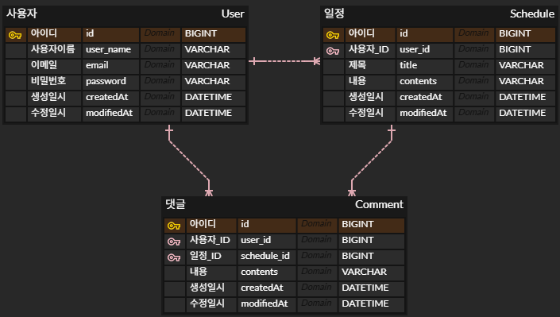

# 📅 일정 관리 앱 Develop (Spring / JPA)

## 1. API 명세서

### 💻 사용자(User) API

#### (1) 회원가입

| Method | Endpoint | Description | Status Code   |
|:-------|:---------|:------------|:--------------|
| `POST` | `/users` | 회원 가입       | `201 CREATED` |

- **Request Body**

```json
{
  "userName": "string (4~10자, 영문 소문자/숫자)",
  "email": "string (이메일 형식)",
  "password": "string (8자 이상)"
}
````

- **Response**

```json
{
  "id": "long",
  "userName": "string",
  "email": "string",
  "createdAt": "string",
  "modifiedAt": "string"
}
```

-----

#### (2) 로그인

| Method | Endpoint       | Description | Status Code |
|:-------|:---------------|:------------|:------------|
| `POST` | `/users/login` | 로그인         | `200 OK`    |

- **Request Body**

```json
{
  "email": "string",
  "password": "string"
}
```

- **Response**

```json
{
  "message": "로그인 성공"
}
```

-----

#### (3) 사용자 전체 목록 조회

| Method | Endpoint | Description  | Status Code |
|:-------|:---------|:-------------|:------------|
| `GET`  | `/users` | 모든 사용자 정보 조회 | `200 OK`    |

- **Response**
```json
[
  {
    "id": "long",
    "userName": "string",
    "email": "string",
    "createdAt": "string",
    "modifiedAt": "string"
  }
]
```

-----

#### (4) 사용자 단일 조회

| Method | Endpoint      | Description  | Parameters | Status Code |
|:-------|:--------------|:-------------|:-----------|:------------|
| `GET`  | `/users/{id}` | 단일 사용자 정보 조회 | `Path: id` | `200 OK`    |

- **Response**
```json
{
  "id": "long",
  "userName": "string",
  "email": "string",
  "createdAt": "string",
  "modifiedAt": "string"
}
```

\<br\>

### 📝 일정(Schedule) API

> 일정 생성, 수정, 삭제 API는 인증(로그인)이 필수

#### (1) 일정 생성

| Method | Endpoint     | Description | Status Code   |
|:-------|:-------------|:------------|:--------------|
| `POST` | `/schedules` | 일정 생성       | `201 CREATED` |

- **Request Body**
```json
{
  "title": "string (1~10자)",
  "contents": "string"
}
```

- **Response**
```json
{
  "scheduleId": "long",
  "title": "string",
  "contents": "string",
  "userName": "string",
  "createdAt": "string",
  "modifiedAt": "string"
}
```

-----

#### (2) 전체 일정 페이징 조회

| Method | Endpoint     | Description  | Parameters            | Status Code |
|:-------|:-------------|:-------------|:----------------------|:------------|
| `GET`  | `/schedules` | 모든 일정 페이징 조회 | - `Query: page, size` | `200 OK`    |

- **Parameters**
    - `page`: 페이지 번호 (0부터 시작, 기본값: 0)
    - `size`: 페이지 크기 (기본값: 10)

- **Response**
```json
{
  "content": [
    {
      "scheduleId": "long",
      "title": "string",
      "contents": "string",
      "commentCount": "int",
      "userName": "string",
      "createdAt": "string",
      "modifiedAt": "string"
    }
  ],
  "pageable": {
    "pageNumber": 0,
    "pageSize": 10,
    "sort": {
      "empty": false,
      "sorted": true,
      "unsorted": false
    },
    "offset": 0,
    "paged": true,
    "unpaged": false
  },
  "totalPages": 1,
  "totalElements": 3,
  "first": true,
  "numberOfElements": 3,
  "size": 5,
  "number": 0,
  "sort": {
    "empty": false,
    "sorted": true,
    "unsorted": false
  },
  "empty": false
}
```

-----

#### (3) 선택 일정 조회

| Method | Endpoint                  | Description | Parameters         | Status Code |
|:-------|:--------------------------|:------------|:-------------------|:------------|
| `GET`  | `/schedules/{scheduleId}` | 선택 일정 조회    | `Path: scheduleId` | `200 OK`    |

- **Response**
```json
{
  "scheduleId": "long",
  "title": "string",
  "contents": "string",
  "userName": "string",
  "createdAt": "string",
  "modifiedAt": "string"
}
```

-----

#### (4) 일정 수정

| Method | Endpoint                  | Description | Parameters         | Status Code |
|:-------|:--------------------------|:------------|:-------------------|:------------|
| `PUT`  | `/schedules/{scheduleId}` | 일정 수정       | `Path: scheduleId` | `200 OK`    |

- **Request Body**
```json
{
  "title": "string (1~10자)",
  "contents": "string"
}
```

- **Response**
```json
{
  "scheduleId": "long",
  "title": "string",
  "contents": "string",
  "userName": "string",
  "createdAt": "string",
  "modifiedAt": "string"
}
```

-----

#### (5) 일정 삭제

| Method   | Endpoint                  | Description | Parameters         | Status Code |
|:---------|:--------------------------|:------------|:-------------------|:------------|
| `DELETE` | `/schedules/{scheduleId}` | 본인 일정 삭제    | `Path: scheduleId` | `200 OK`    |

- **Response**: 없음


---


### 💬 댓글(Comment) API

> 댓글 생성, 수정, 삭제 API는 인증(로그인)이 필수

#### (1) 댓글 생성

| Method | Endpoint                           | Description | Parameters         | Status Code   |
|:-------|:-----------------------------------|:------------|:-------------------|:--------------|
| `POST` | `/schedules/{scheduleId}/comments` | 댓글 생성       | `Path: scheduleId` | `201 CREATED` |

- **Request Body**
```json
{
  "contents": "string"
}
```

- **Response**
```json
{
  "id": "long",
  "contents": "string",
  "userName": "string",
  "scheduleId": "long",
  "createdAt": "string",
  "modifiedAt": "string"
}
```

-----

#### (2) 특정 일정의 댓글 목록 조회

| Method | Endpoint                           | Description | Parameters         | Status Code |
|:-------|:-----------------------------------|:------------|:-------------------|:------------|
| `GET`  | `/schedules/{scheduleId}/comments` | 댓글 목록 조회    | `Path: scheduleId` | `200 OK`    |

- **Response**
```json
[
  {
    "id": "long",
    "contents": "string",
    "userName": "string",
    "scheduleId": "long",
    "createdAt": "string",
    "modifiedAt": "string"
  }
]
```

-----

#### (3) 댓글 수정

| Method | Endpoint                | Description | Parameters        | Status Code |
|:-------|:------------------------|:------------|:------------------|:------------|
| `PUT`  | `/comments/{commentId}` | 본인 댓글 수정    | `Path: commentId` | `200 OK`    |

- **Request Body**
```json
{
  "contents": "string"
}
```

- **Response**
<!-- end list -->

```json
{
  "id": "long",
  "contents": "string",
  "userName": "string",
  "scheduleId": "long",
  "createdAt": "string",
  "modifiedAt": "string"
}
```

-----

#### (4) 댓글 삭제

| Method   | Endpoint                | Description   | Parameters        | Status Code |
|:---------|:------------------------|:--------------|:------------------|:------------|
| `DELETE` | `/comments/{commentId}` | **본인의** 댓글 삭제 | `Path: commentId` | `200 OK`    |

- **Response**: 없음


-------


## 2\. ERD

### Entity

1. **User (사용자)**

- `id` (PK)
- `userName`
- `email` (UNIQUE)
- `password` 
- `createdAt`, `modifiedAt`

2. **Schedule (일정)**

- `scheduleId` (PK)
- `title`
- `contents`
- `createdAt`, `modifiedAt`
- `user_id` (FK)

3. **Comment (댓글)**

- `id` (PK)
- `contents`
- `createdAt`, `modifiedAt`
- `user_id` (FK)
- `schedule_id` (FK)

### 관계

- **User : Schedule = 1 : N**
    - 한 명의 사용자는 여러 일정을 작성할 수 있습니다.
- **User : Comment = 1 : N**
    - 한 명의 사용자는 여러 댓글을 작성할 수 있습니다.
- **Schedule : Comment = 1 : N**
    - 하나의 일정에는 여러 댓글이 달릴 수 있습니다.

### ERD 이미지
