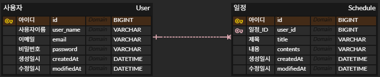

# 📅 일정 관리 앱 (Spring/JPA)

## 1. API 명세서

## 💻 사용자(User) 및 로그인(Login) API

#### (1) 회원가입

| Method | Endpoint        | Description | Parameters | Status Code   |
|:-------|:----------------|:------------|:-----------|:--------------|
| `POST` | `/users` | 회원 가입       | 없음         | `201 CREATED` |

- **Request Body**

```json
{
  "userName": "string",
  "email": "string",
  "password": "string"
}
````

- **Response**

```json
{
  "id": "long",
  "userName": "string",
  "email": "string",
  "createdAt": "string",
  "modifiedAt": "string"
}
```

-----

#### (2) 로그인

| Method | Endpoint       | Description | Parameters | Status Code |
|:-------|:---------------|:------------|:-----------|:------------|
| `POST` | `/users/login` | 로그인         | 없음         | `200 OK`    |

- **Request Body**

```json
{
  "email": "string",
  "password": "string"
}
```

- **Response**

> 성공 시 Body 없이 응답 헤더에 `Set-Cookie` 포함

```json
{
  "message": "로그인 성공"
}
```

-----

#### (3) 사용자 단일 조회

| Method | Endpoint      | Description  | Parameters | Status Code |
|:-------|:--------------|:-------------|:-----------|:------------|
| `GET`  | `/users/{id}` | 단일 사용자 정보 조회 | `Path: id` | `200 OK`    |

- **Request Body**: 없음
- **Response**

```json
{
  "id": "long",
  "userName": "string",
  "email": "string",
  "createdAt": "string",
  "modifiedAt": "string"
}
```

-----

#### (4) 사용자 전체 목록 조회

| Method | Endpoint          | Description  | Parameters | Status Code |
|:-------|:------------------|:-------------|:-----------|:------------|
| `GET`  | `/users` | 모든 사용자 정보 조회 | 없음         | `200 OK`    |

- **Request Body**: 없음
- **Response**

```json
[ 
   {
   "id": "long",
   "userName": "string",
   "email": "string",
   "createdAt": "string",
   "modifiedAt": "string"
  },
   {
      "id": "long",
      "userName": "string",
      "email": "string",
      "createdAt": "string",
      "modifiedAt": "string"
   }
]
```

-----

#### (5) 사용자 정보 수정
**Note:** 본인만 수정 가능하도록 인증/인가 처리 필요

| Method | Endpoint      | Description | Parameters     | Status Code |
|:-------|:--------------|:------------|:---------------|:------------|
| `PUT`  | `/users/{id}` | 사용자 정보 수정   | `Path: id` | `200 OK`    |

- **Request Body**
```json
{
  "userName": "string",
   "email": "string",
  "password": "string"
}
```

- **Response**
```json
{
  "id": "long",
  "userName": "string",
  "email": "string",
  "createdAt": "string",
  "modifiedAt": "string"
}
```

-----

#### (6) 회원 탈퇴

> **Note:** 본인만 탈퇴 가능하도록 인증/인가 처리 필요

| Method   | Endpoint      | Description | Parameters     | Status Code |
|:---------|:--------------|:------------|:---------------|:------------|
| `DELETE` | `/users/{id}` | 탈퇴          | `Path: id` | `200 OK`    |

- **Request Body**: 없음

- **Response**: 없음


-----

### 📝 일정(Schedule) API

#### (1) 일정 생성

| Method | Endpoint     | Description | Parameters | Status Code   |
|:-------|:-------------|:------------|:-----------|:--------------|
| `POST` | `/schedules` | 일정 생성       | 없음         | `201 CREATED` |

- **Request Body**

```json
{
  "title": "string",
  "contents": "string"
}
```

- **Response**
```json
{
  "id": "long",
  "title": "string",
  "contents": "string",
  "userName": "string",
  "createdAt": "string",
  "modifiedAt": "string"
}
```

-----

#### (2) 전체 일정 목록 조회

| Method | Endpoint     | Description        | Parameters | Status Code |
|:-------|:-------------|:-------------------|:-----------|:------------|
| `GET`  | `/schedules` | 모든 일정 조회 | 없음         | `200 OK`    |

- **Request Body**: 없음

- **Response**
```json
[
  {
    "id": "long",
    "title": "string",
    "contents": "string",
    "userName": "string",
    "createdAt": "string",
    "modifiedAt": "string"
  }
]
```

-----

#### (3) 선택 일정 조회

| Method | Endpoint                  | Description  | Parameters         | Status Code |
|:-------|:--------------------------|:-------------|:-------------------|:------------|
| `GET`  | `/schedules/{scheduleId}` | 선택 일정 조회 | `Path: scheduleId` | `200 OK`    |

- **Request Body**: 없음

- **Response**
```json
{
   "id": "long",
   "title": "string",
   "contents": "string",
   "userName": "string",
   "createdAt": "string",
   "modifiedAt": "string"
}
```

-----

#### (4) 일정 수정

| Method | Endpoint                  | Description       | Parameters         | Status Code |
|:-------|:--------------------------|:------------------|:-------------------|:------------|
| `PUT`  | `/schedules/{scheduleId}` | 일정 수정       | `Path: scheduleId` | `200 OK`    |

- **Request Body**
```json
{
  "title": "string",
  "contents": "string"
}
```

- **Response**
```json
{
  "id": "long",
  "title": "string",
  "contents": "string",
  "userName": "string",
  "createdAt": "string",
  "modifiedAt": "string"
}
```

-----

#### (5) 일정 삭제

| Method   | Endpoint                  | Description       | Parameters         | Status Code |
|:---------|:--------------------------|:------------------|:-------------------|:------------|
| `DELETE` | `/schedules/{scheduleId}` | 일정 삭제         | `Path: scheduleId` | `200 OK`    |

- **Request Body**: 없음

- **Response**: 없음


<br>


## 2. ERD


1. **User (사용자)**

    - `id` (PK): 사용자 고유 ID
    - `user_name`: 사용자 이름
    - `email` (UNIQUE): 이메일 (로그인 시 사용)
    - `password`: 비밀번호
    - `created_at`: 생성일시
    - `modified_at`: 수정일시
   

2. **Schedule (일정)**

    - `id` (PK): 일정 고유 ID
    - `title`: 일정 제목
    - `contents`: 일정 내용
    - `created_at`: 생성일시
    - `modified_at`: 수정일시
    - `user_id` (FK): 사용자와의 연관 관계 키

### 관계

- **User : Schedule = 1 : N**
    - 한 명의 사용자는 여러 개의 일정을 작성
    - 하나의 일정은 한 명의 사용자

### ERD 이미지
